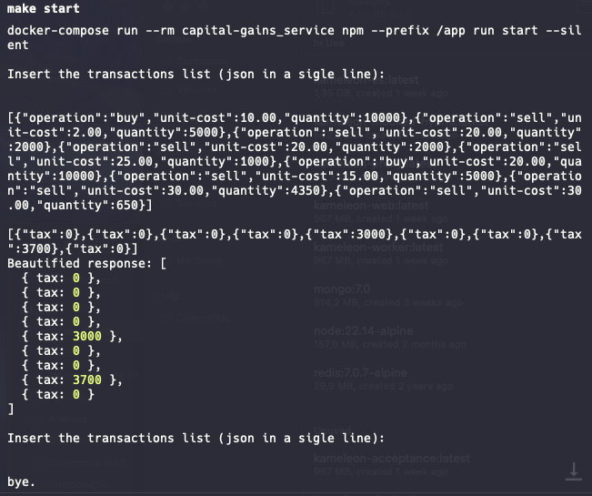
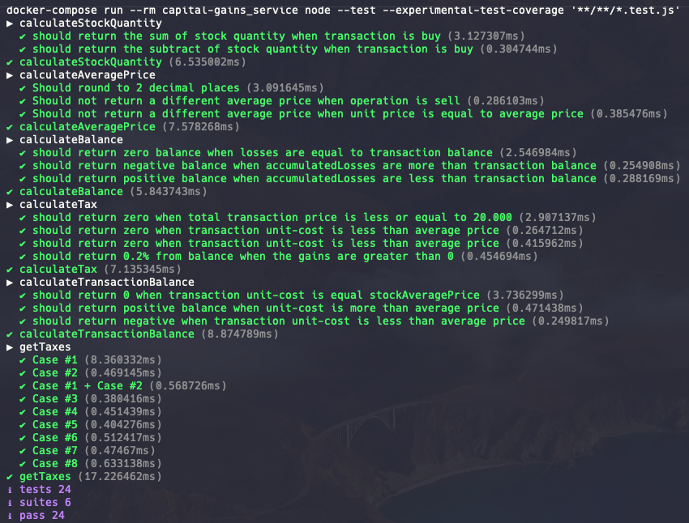

# Capital Gains

## Objetivo do projeto:
O objetivo deste projeto é simular a implementação de um programa de linha de comando (CLI) que calcula o imposto a ser pago sobre lucros ou prejuízos de operações no mercado financeiro de ações.


## Decisões técnicas e arquiteturais:

Inicialmente optei por fazer o código em javascript (nodejs) devido primeiramente ao conhecimento da tecnologia e também pela simplicidade que seria criar um CLI e testes.<br>

A organização arquitetural do projeto (design de código) ficou bem simples mas não menos intuitiva. Tudo começa no arquivo `/src/index.js` (bootstrap) que é responsável apenas por lidar com entrada e saída de dados.<br>
Depois criei um arquivo chamado `/src/domain/getTaxes.js` (wrapper) que seria o código principal. Nele dividi as operações de compra e venda e chamei funções mais minimalistas.
Estas funções minimalistas deixei dentro da pasta `/src/domain/calculation`.<br>
Para finalizar criei todos os casos de teste que continha no exercicio e fiz alguns pontuais em casa função menor.<br>

Um Makefile foi criado para facilitar a execução da aplicação e dos testes. Basta digitar `make` para ver as opções disponívels.<br>

## Como executar o projeto:

Rode o comando `make start`
Uma vez tendo acessado o nodejs, basta inserir os inputs em uma linha apenas. Para sair, aperte `Enter`. Exemplo:

**Dados de entrada:**
```json
[{"operation":"buy","unit-cost":10.00,"quantity":10000},{"operation":"sell","unit-cost":2.00,"quantity":5000},{"operation":"sell","unit-cost":20.00,"quantity":2000},{"operation":"sell","unit-cost":20.00,"quantity":2000},{"operation":"sell","unit-cost":25.00,"quantity":1000},{"operation":"buy","unit-cost":20.00,"quantity":10000},{"operation":"sell","unit-cost":15.00,"quantity":5000},{"operation":"sell","unit-cost":30.00,"quantity":4350},{"operation":"sell","unit-cost":30.00,"quantity":650}]
```

**Demonstração:**<br>


## Como executar os testes:

Rode o comando `make tests`

**Demonstração:**<br>

